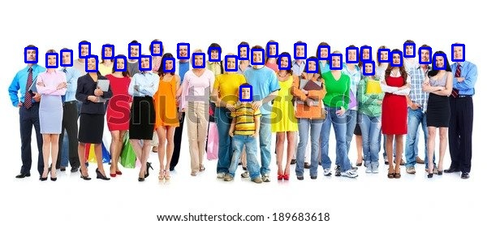
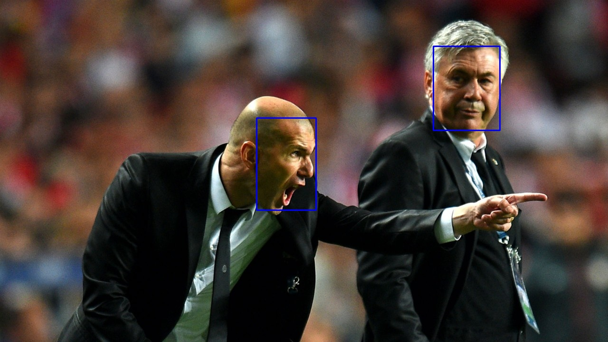

# YOLOv8-Face

<a target="_blank" href="https://colab.research.google.com/drive/14QfCaIClnfSmHjjVkMNoMtZ0MlRhCwr6?usp=sharing">
  
</a>

YOLOv8 for Face Detection. The project is a fork over [ultralytics](https://github.com/ultralytics/ultralytics) repo. They made a simple interface for training and run inference. Model detects faces on images and returns bounding boxes, score and class.

The next table presents the performance of the different model on some hardware configurations and their evaluation over the different subsets (easy, medium, hard) of the WiderFace validation set.  

We added results from multi-scale testing using NMS and Weighted Boxes Fusion from [ZFTurbo/Weighted-Boxes-Fusion repo](https://github.com/ZFTurbo/Weighted-Boxes-Fusion) to obtain the final bounding boxes. We used original scales and [500, 800, 1100, 1400, 1700] as those were the ones used in RetinaFace (we still lack of flip).

**Model** | YOLOv8 nano | YOLOv8 medium | RetinaFace-MNet0.25[^1] | RetinaFace-R50[^1] 
--- | :---: | :---: | :---: | :---:
**Avg. FPS (RTX 4090)** | 169 | 117 | 44 | 39 
**Avg. FPS (Colab Tesla T4)** | 82 | 31 | 25 | 20
**Avg. FPS (GTX 1650 with Max-Q Design)** | 55 | 28 | 19 | 16
| | | |
**WiderFace Easy Val. AP** | 0.8833 | 0.9759  | 0.8382 | 0.9067
**+Multi-Scale+NMS** | 0.8835 | 0.9740 | --- | ---
**+Multi-Scale+Weighted Boxes Fusion** | 0.8902 | 0.9747 | --- | ---
| | | |
**WiderFace Medium Val. AP** | 0.8273 | 0.9483 | 0.7678 | 0.8602
**+Multi-Scale+NMS** | 0.8324 | 0.9481  | --- | ---
**+Multi-Scale+Weighted Boxes Fusion** | 0.8439 | 0.9499 | --- | ---
| | | |
**WiderFace Hard Val. AP** | 0.6049 | 0.7695 | | 0.4320 | 0.5520
**+Multi-Scale+NMS** | 0.6356 | 0.7864  | --- | ---
**+Multi-Scale+Weighted Boxes Fusion** | 0.6416 | 0.7923 | --- | ---

[^1]: RetinaFace based on [hphuongdhsp/retinaface](https://github.com/hphuongdhsp/retinaface) repo that is built on top of the [biubug6/Pytorch_Retinaface](https://github.com/biubug6/Pytorch_Retinaface) implementation.  
R50 = ResNet-50 and MNet0.25 = MobileNet-0.25

## Installation

I recommend to use a new virtual environment and install the following packages:

```bash
# Install pytorch for CUDA 11.7 from pip
pip3 install torch torchvision torchaudio --extra-index-url https://download.pytorch.org/whl/cu117
```
or alternatively if you are using conda

```bash
# Install pytorch for CUDA 11.7 from conda
conda install pytorch torchvision torchaudio pytorch-cuda=11.7 -c pytorch -c nvidia
```

then you install the ultralytics package (this code works for *ultralytics-8.0.21*) and the ensemble boxes package.
```bash
pip install ultralytics
pip install ensemble-boxes
```

## Usage

There are a few python scripts, [train.py](train.py) is to train a yolov8 model, [test.py](test.py) is to test the model with images and [demo.py](demo.py) is to launch a real-time demo of the model with your webcam.

You must configure [wider.yaml](datasets/wider.yaml) according to the path in your pc (default settings are relative to [datasets](datasets) folder).

# WIDERFACE EVALUATION
You must download the [WIDERFACE official evaluation code and results](http://shuoyang1213.me/WIDERFACE/support/eval_script/eval_tools.zip) and extract the ground_truth folder that contains easy, medium and hard validation subsets.  

Then you must run `python evaluation.py -w <pretrained_model> -p <new prediction path> -e <path val images>` to create .txt evaluation files in the proper format.  

Finally you run `cd Evaluation`, build Cython code with `python setup.py build_ext --inplace` and evaluate your .txt files with `python evaluation.py -p <your prediction dir> -g <groud truth dir>` to get Val. AP per each subset.

WiderFace-Evaluation code is extracted from [wondervictor/WiderFace-Evaluation](https://github.com/wondervictor/WiderFace-Evaluation) repo.  


# Arguments

The training arguments
```python
parser = argparse.ArgumentParser(description='Train YOLOv8 for Face Detection')
parser.add_argument('-b', '--batch', type=int, help='Batch Size', default=8)
parser.add_argument('-e', '--epochs', type=int, help='Number of Epochs', default=100)
parser.add_argument('-w', '--workers', type=int, help='Workers for datalaoder', default=2)
parser.add_argument('--pretrained', action='store_true', help='Finetune')
parser.add_argument('--no-pretrained', dest='pretrained', action='store_false', help='Train from zero.')
parser.set_defaults(pretrained=False)
parser.add_argument('-i', '--imgsize', type=int, help='Image size', default=640)
parser.add_argument('-m', '--model',
                    type=str,
                    choices=['yolov8n','yolov8s', 'yolov8m', 'yolov8l', 'yolov8xl'],
                    default='yolov8m',
                    help='YOLOv8 size model')
```

the test arguments

```python
parser.add_argument('-w', '--weights', type=str, help='Path to trained  weights', default='runs/detect/train/weights/best.pt')

parser.add_argument('-t', '--threshold', type=float, help='Score threshold',
                    default=0.5)

parser.add_argument('-i', '--input', type=str, help='Sample input image path',
                    default='test_input.jpg')

parser.add_argument('-o', '--output', type=str, help='Output image path',
                    default='test_output.jpg')
```
evaluation arguments
```python
parser.add_argument('-e', '--eval', type=str, help='Path to WIDER_val/images',
                    default=os.path.join('WIDER_val','images'))

parser.add_argument('-w', '--weights', type=str, help='Path to trained weights',
                        default='yolov8m_200e.pt')

parser.add_argument('-p', '--pred', type=str, help='Path to create evaluation .txt s',
                    default='WIDER_pred')

parser.add_argument('-t', '--threshold', type=float, help='Score threshold',
                    default=0.0001)

parser.add_argument('--multi-scale', action='store_true', help='Multi scale testing', default=False)

parser.add_argument('--vote', type=str, choices=['fusion','nms'], default='fusion', help='Bounding Box vote method')

```

and finally the demo arguments

```python
parser.add_argument('-w', '--weights', type=str, help='Path to trained  weights', default='runs/detect/train/weights/best.pt')

```
## Results



## Downloads

You can download the pretrained weights (YOLOv8 medium) v0.2 for Face Detection [here](https://drive.google.com/file/d/1IJZBcyMHGhzAi0G4aZLcqryqZSjPsps-/view?usp=sharing).

You can download the pretrained weights (YOLOv8 nano) v0.1 for Face Detection [here](https://drive.google.com/file/d/1ZD_CEsbo3p3_dd8eAtRfRxHDV44M0djK/view?usp=sharing). 

You can also download the WiderFace dataset properly formatted to train your own model [here](https://drive.google.com/file/d/1roNilRaLMz4uLqZvINDAyxasG8ncwb5n/view?usp=share_link).
